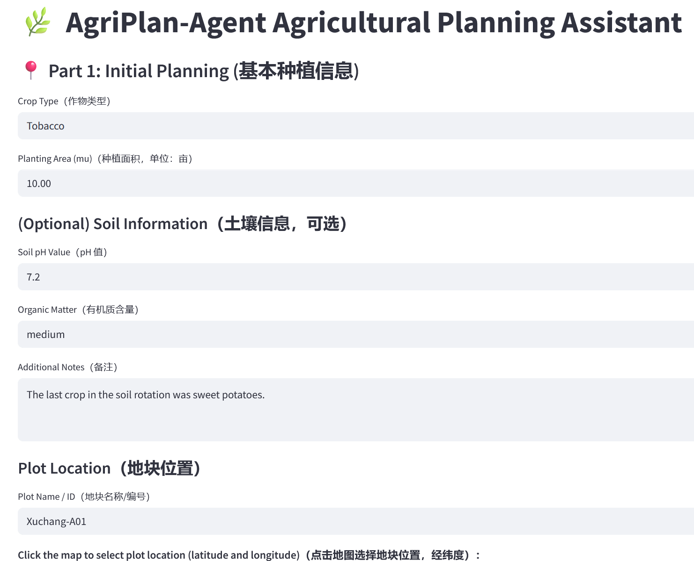
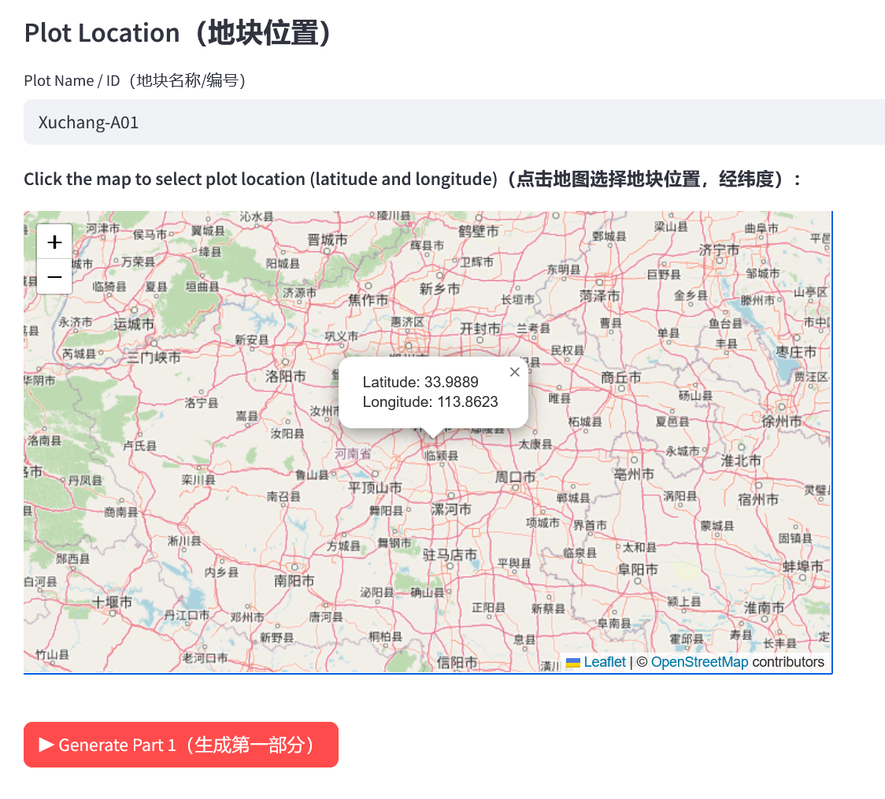
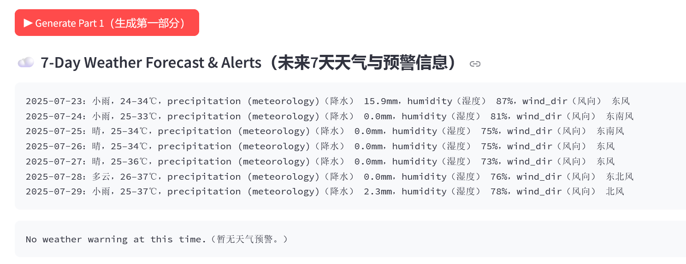
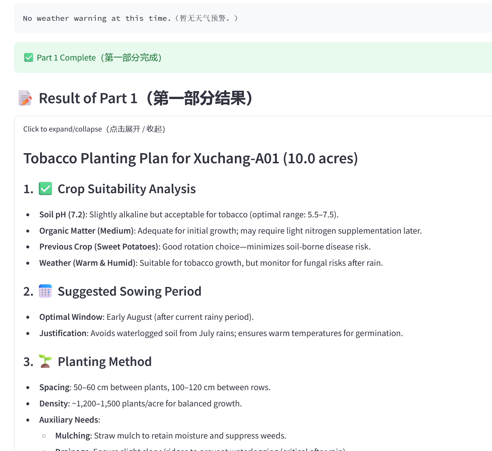
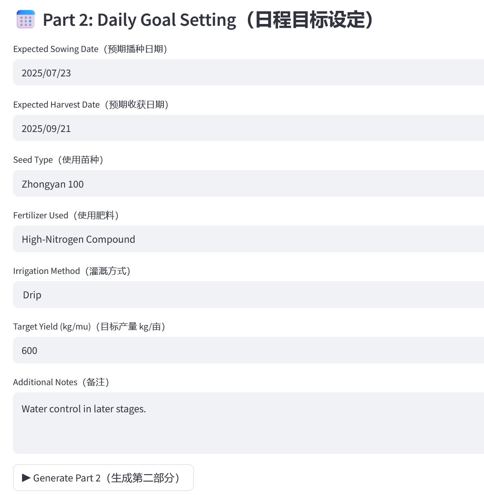
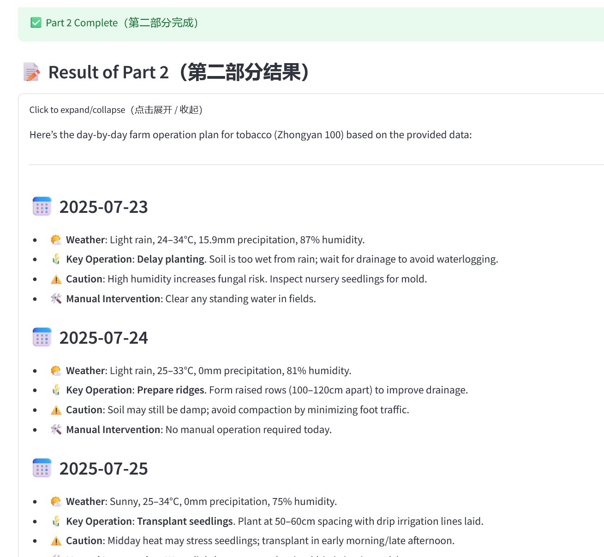
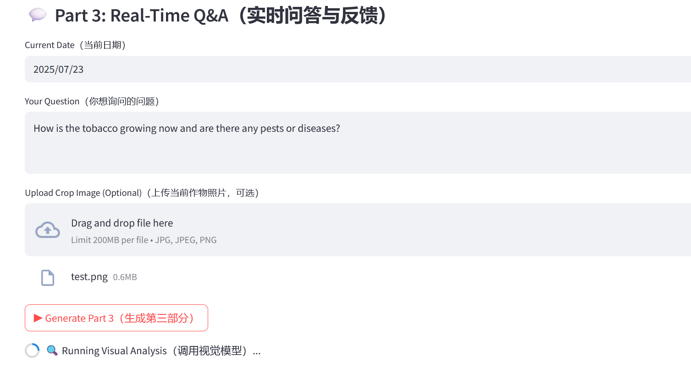
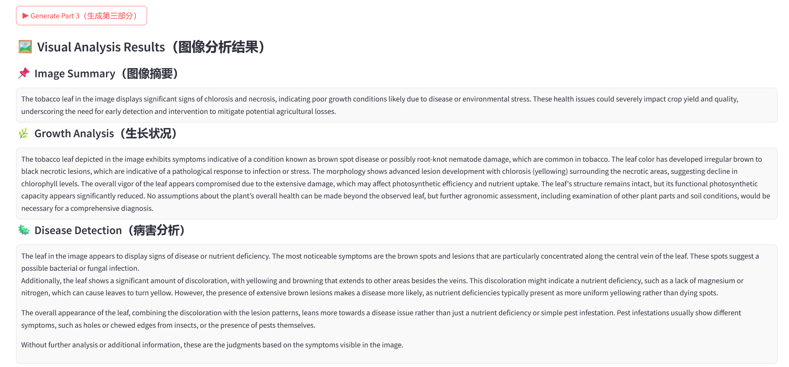
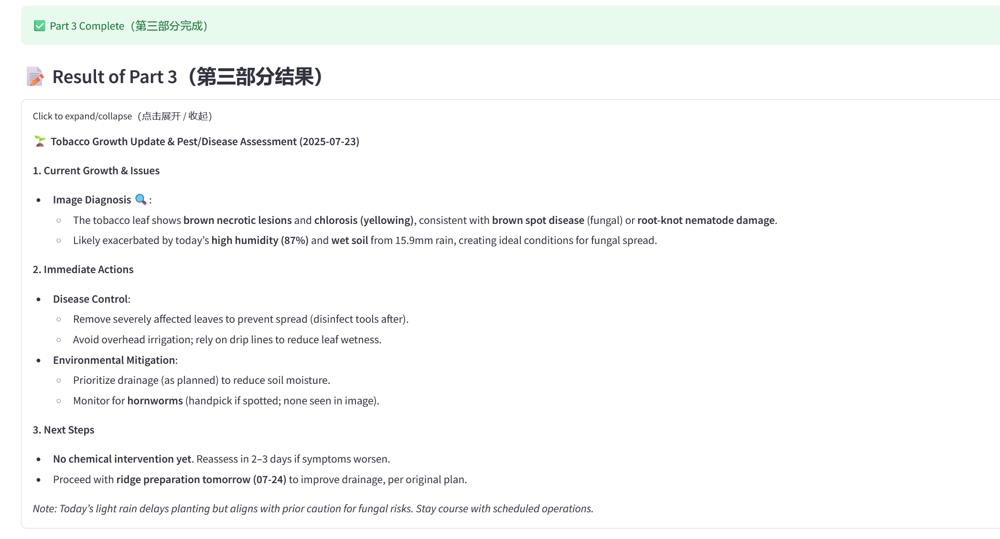

# 🌿 AgriPlan‑Agent: A Multimodal AI Agent for Complex Agricultural Planning  

_A Unified Agentic Framework for Real-World Agricultural Reasoning_


**AgriPlan‑Agent** is an intelligent, multimodal agricultural planning agent system powered by LLMs, VLMs, real-time weather/geolocation sensing, and (future) domain-specific knowledge retrieval. It is designed for real-world **scientific decision-making** in agriculture — capable of planning, reasoning, adapting, and responding to real environmental feedback.


> 🌱 This is not just a chatbot, but a **planning-centric, self-reflective AI agent** capable of autonomous crop decision support — from high-level strategy to daily field actions.

---                                                             
## 🧠 Core Innovations

### 1. 🧩 Context Engineering (上下文工程)

AgriPlan‑Agent leverages a hierarchical **context injection framework** to enable long-context, multi-turn, multimodal reasoning. It models the entire planning process with layered context components:

- 🌍 **Geographic context**: user location, historical records, etc.  

- ☁️ **Environmental context**: 7/30-day weather forecast, alerts  

- 🌱 **Crop-specific context**: sowing period, plant physiology, etc. 

- 📸 **Visual context**: real-time crop images (for disease detection, etc.)  

- 🗂️ **Goal context**: user-defined production goals, scale, constraints


> **All contextual information, after being processed through structured parsing and fusion, is uniformly injected into the LLM reasoning process to achieve semantic consistency and multi-source information alignment.**

---
### 2. 🧠 MCP: Model Context Protocol（模型上下文协议）

To ensure consistent model behavior across different stages of the agent (strategic planning, daily task generation, real-time Q&A), we designed an internal **Model Context Protocol (MCP)** that specifies:

- 🔖 Prompt format conventions  

- ⛓️ Memory chaining logic (e.g., how part 1 summary flows into part 2 and 3)  

- 📎 Tool-calling integration for weather, vision, and retrievers  

- 🔍 Output style consistency and self-reflection mechanisms


This protocol acts like an API schema — but for **model prompt states**, ensuring modular, reproducible, and extensible reasoning capabilities.

---

## 🛠️ System Capabilities

  
| Module                            | Description                                                                                   |
|:---------------------------------:|---------------------------------------------------------------------------------------------|
| 🔧 Part 1                         | **Strategic Planning**: Suitability, sowing time, key phases, risk, intervention              |
| 📅 Part 2                         | **Daily Schedule Generation**: Weather-aware Gantt-style planting timeline                    |
| 🤖 Part 3                         | **Realtime Q&A + Image Analysis**: Answer user questions with or without uploaded crop photos |
| 📚 Knowledge Retrieval (reserved) | Modular retriever module for user-uploaded docs (PDF, CSV, guides, etc.)                      |

  All outputs are designed to be:

- 🧾 Professionally formatted  

- 👩‍🌾 Friendly for field-level execution  

- ⚠️ Grounded in real environmental constraints  

- 🚫 Avoiding unnecessary manual intervention unless strictly necessary

---

  

## 🔭 Vision: Toward Autonomous Scientific AI Agents

  

AgriPlan‑Agent exemplifies our broader research vision:  

> **Can an AI agent plan and manage scientific procedures in real-world environments, grounded in multimodal, uncertain inputs?**

  

By combining:

- 🧠 Large Language Models (ChatGPT, Gemini, Claude, DeepSeek, Qwen, etc.)  

- 🖼️ Multimodal Visual Reasoning (e.g.,VLM, BLIP2, YOLO)  

- 📡 Real-time Sensing and API Integration  

- 📚 Knowledge-grounded Retrieval  

- 🧱 Modular Context Composition Protocol

  

...we are building the **next generation of domain-specialized, self-reflective planning agents** — starting from agriculture 🌾

  

---

## 🧪 Field Testing: Tobacco as a Complex Planning Benchmark（烟草种植场景实测验证）

To benchmark AgriPlan‑Agent’s capabilities, we selected **tobacco** — a crop known for its long growth cycle, multi-stage interventions, and sensitivity to environmental factors — as our primary testing scenario.

We collaborated with senior agronomists to evaluate the agent’s output, including:

- Long-term planting feasibility reports  
- Gantt-style daily management plans  
- Image-based health and disease diagnoses  

✅ The results were validated as **professionally valuable** and **operationally feasible** in real-world agricultural production.

<!-- 9‑Grid Showcase: Tobacco Field Test UI (text on top) -->
<table>
  <tr>
    <td align="center">
      <b>Part 1 – Basic Info<br/>第一步：基础信息输入</b><br/>
      
    </td>
    <td align="center">
      <b>Plot Selection Map<br/>地块经纬度选择</b><br/>
      
    </td>
    <td align="center">
      <b>Weather Forecast & Alerts<br/>天气与预警</b><br/>
      
    </td>
  </tr>
  <tr>
    <td align="center">
      <b>Suitability Summary<br/>适宜性评估结果</b><br/>
      
    </td>
    <td align="center">
      <b>Part 2 – Goal Input<br/>第二步：目标设定</b><br/>
      
    </td>
    <td align="center">
      <b>Daily Plan Output<br/>逐日计划生成</b><br/>
      
    </td>
  </tr>
  <tr>
    <td align="center">
      <b>Part 3 – Q&A Input<br/>第三步：实时问答输入</b><br/>
      
    </td>
    <td align="center">
      <b>Image Diagnosis<br/>图像诊断过程</b><br/>
      
    </td>
    <td align="center">
      <b>Realtime Answer<br/>实时回答输出</b><br/>
      
    </td>
  </tr>
</table>

---

## 🚀 How to Try AgriPlan‑Agent（试用方式）

You can launch the system locally or on a cloud platform such as **Streamlit Cloud**, **Railway**, or **Render.com**.

```bash
# Step 1: Clone the repository
git clone https://github.com/TopoSpace/AgriPlan_multimodal-AI-agent.git
cd AgriPlan_multimodal-AI-agent

# Step 2: Install dependencies (recommend using virtual environment)
pip install -r requirements.txt

# Step 3: Run Streamlit app
streamlit run main.py
```

---
## 📄 License（开源许可）

AgriPlan‑Agent is released under the [MIT License](https://opensource.org/licenses/MIT) — free to use, modify, and integrate into other projects for research or practical deployment.  

AgriPlan‑Agent 遵循 [MIT 开源协议](https://opensource.org/licenses/MIT)，可自由使用、修改与集成，用于科研或实际部署。

**MIT License © 2025 TopoSpace Research Center**

